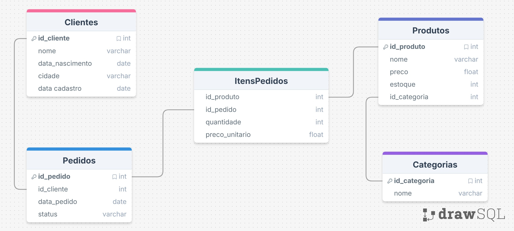

# Plataforma Interativa de Desafios de SQL

Este projeto foi desenvolvido para oferecer desafios práticos de SQL, compondo a parte aplicada do Curso de SQL com Aplicação a Problemas de Negócios. O objetivo do curso é ensinar os fundamentos da linguagem SQL, capacitando os estudantes a compreender e utilizar suas principais funções e, além disso, aplicá-los na resolução de problemas reais de negócio. A iniciativa é do [Grupo de Processamento e Análise de Dados (PANDA)](linktr.ee/pandaufscar) da Universidade Federal de São Carlos (UFSCar) e busca integrar teoria e prática, desenvolvendo raciocínio analítico e habilidades essenciais em manipulação e análise de dados.

A implementação da plataforma e o desenvolvimento técnico do projeto foram realizados pelo membro **Lucas Battisti** ([@lucas-battisti](https://github.com/lucas-battisti)).

🔗 **Acesse a plataforma online:**  
https://desafios-sql.streamlit.app/

## 🚀 Funcionalidades:

- **Foco em problemas reais de negócio**: Exercícios baseados em situações práticas, aproximando o aluno do mercado.
- **Feedback instantâneo**: Indicação clara de acerto ou erro para acelerar o aprendizado, assim, o aluno aprende fazendo, testando e ajustando suas consultas.
- **Validação inteligente**: Compara a reposta do aluno com o esperado ignorando detalhes irrelevantes como: nome e ordem das colunas ou linhas.
- **Visualização do esquema do banco**: Acesso ao diagrama da base de dados, facilitando a compreensão das tabelas, chaves e relacionamentos antes da construção das consultas.

## 🛠️ Tecnologias Utilizadas

- **Python**: Linguagem utilizada.
- **Streamlit**: Para a interface web interativa.
- **Pandas**: Manipulação e comparação de dados.
- **SQLite3**: Banco de dados local.

## 📊 Base de dados



Este banco de dados representa um sistema simples de gestão de vendas de uma papelaria. Ele armazena informações sobre clientes, produtos disponíveis, categorias de produtos e os pedidos realizados.

A estrutura é composta por cinco tabelas: `Clientes`, `Produtos`, `Categorias`, `Pedidos` e `ItensPedidos`. Cada pedido feito por um cliente pode ter vários produtos diferentes. Para registrar isso, existe uma tabela chamada `ItensPedidos`, que funciona como uma lista dos produtos que fazem parte de cada pedido.

Nela ficam registrados quais produtos foram comprados, em que quantidade e qual era o preço no momento da compra.

## 📁 Estrutura do Projeto

```bash
plataforma-sql-panda/
├── app.py                  # ← Arquivo principal (Streamlit)
├── desafio.py              # ← Lógica de exibição, execução e validação
├── dados/
│   └── fundamentos.py          # ← Desafios do módulo Fundamentos
│   └── joins.py                # ← Desafios do módulo Joins
│   └── agregacoes.py           # ← Desafios do módulo Agregações
├── dados/
│   └── dados.db            # ← Banco SQLite com todos os dados
│   └── dados.sql           # ← Código SQLite que gera os dados e cria o dados.db
│   └── dados.py            # ← Código Python que executa o dados.sql
├── schema.jpg              # ← Diagrama do banco (usado na interface)
├── requirements.txt
└── README.md
```

## ✅ TO-DO

- Melhorar design das páginas de módulos
- Adicionar mais exercícios
- Melhorar requirements.txt
